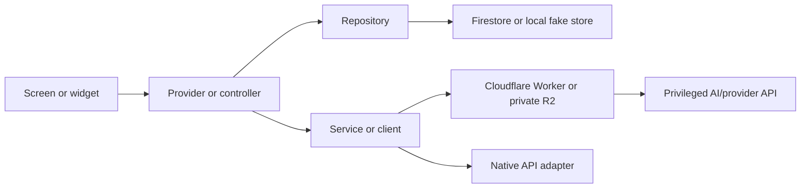

# Optivus Application Architecture

Status: Phase 0 complete — ownership and boundary freeze

Applies to: the Flutter client, Firebase data access, Cloudflare Workers/R2,
and native-service adapters in this repository

## 1. Purpose and scope

This document defines where Optivus code and data belong. It freezes:

- ownership of the six main application areas;
- layer responsibilities and dependency direction;
- presentation, canonical, persisted, derived, and seeded state boundaries;
- repository and external-integration boundaries;
- permitted cross-feature commands and events; and
- rules that later persistence, native, AI, and release phases must follow.

It describes the repository as it exists. A documented target is not an
implemented integration. Provenance status is owned by the
[data-source contract](DATA_SOURCE_CONTRACT.md); in architecture summaries:

- **Configurable durable path** — a backend implementation exists but may not
  be the active or verified production source, so this label does not mean
  **Live**.
- **Local/in-memory** — works during the process lifetime but is not durable.
- **Seeded/demo** — deterministic or static sample content used to demonstrate
  a UI.
- **Pending/unavailable** — a screen, interface, path, or client may exist, but
  the complete production behavior is not connected.

The six application areas are Home, Routine, Tracker, Goals, Coach, and
Profile. Authentication and Onboarding are entry/setup flows. The detailed
product ownership table is in the
[as-built product blueprint](OPTIVUS_PRODUCT_BLUEPRINT_AS_BUILT.md).

Related contracts:

- [Navigation](NAVIGATION.md) is route, guard, tab, detail, and modal truth.
- [Design system](DESIGN_SYSTEM.md) is token and shared-component truth.
- [Data-source contract](DATA_SOURCE_CONTRACT.md) is capability provenance
  truth.
- [Routine data contract](ROUTINE_DATA_CONTRACT.md) is Routine template,
  occurrence, projection, codec, and restore truth.
- [Technical-debt register](TECHNICAL_DEBT.md) is stable debt/planning truth.

## 2. Application structure

| Location | Current responsibility | Boundary and status |
| --- | --- | --- |
| `lib/app/` | Root `MaterialApp`, app-wide tab selection, and six-tab shell coordination | App composition only. It must not become a domain-data store. |
| `lib/core/` | `go_router` configuration, theme tokens, utilities, and reusable UI primitives | Cross-feature infrastructure. Feature-specific behavior must stay under its owner. |
| `lib/features/` | Area-owned tabs, screens, widgets, navigation request state, and some feature-local providers | Intended home for presentation state and user actions. State organization is incomplete for several areas. |
| `lib/models/` | Shared data structures for Routine, Tracker, Goals, Coach, Onboarding, profile, uploads, and settings | Models do not depend on UI widgets. Several models currently include Firestore timestamp/serialization concerns; that is an existing persistence-coupling pattern, not permission to add UI or network behavior to models. |
| `lib/repositories/` | Data-access contracts plus fake and selected Firestore implementations | Repositories own reads/writes for durable domain records. Most post-onboarding area repositories are still fake. `FirestoreUserPaths` reserves target paths; a reserved path is not an implemented repository. |
| `lib/services/` | Worker/HTTP clients, R2 upload orchestration, image preparation, Onboarding projection/hydration, Routine-import conversion/validation, and native adapter interfaces | Services own external integrations or orchestration that does not belong to one repository. They must not become a second canonical store. |
| `lib/state/` | Auth, region, upload/import controllers, and a large set of global mock providers | Transitional. `lib/state/app_state.dart` currently mixes state for multiple application areas and must be reduced incrementally as each area gains a canonical owner. |
| `lib/config/` | Compile-time backend, Worker, upload, Firebase, and upload-policy configuration | Configuration selects capabilities. It must not contain provider secrets or silently substitute demo behavior in production. |

Additional current structures:

- `lib/views/screens/` contains top-level welcome, auth, loading, and app-shell
  screens. These are entry/shell screens, not a seventh application area.
- `lib/widgets/`, `lib/core/widgets/`, and feature `widgets/` directories all
  contain reusable-looking UI. Their overlap is transitional and recorded as
  [TD-007](TECHNICAL_DEBT.md#4-active-debt-register).
- `workers/` contains the deployable Cloudflare Worker projects. Workers are
  external-system adapters, not Flutter presentation or canonical app state.
- `firestore.rules` is the authorization/schema boundary for Firestore. Its
  current verified-owner catch-all is development-only debt.

The signed-in application shell in `lib/views/screens/app_shell.dart` keeps the
six tabs alive in an `IndexedStack`. `lib/core/router/app_router.dart` owns auth
gating and maps deep links to a tab plus that tab's inline detail request.

## 3. Dependency direction

The primary dependency flow is:



The following rules apply to new work:

1. Widgets must not call Firestore directly.
2. Widgets must not construct HTTP/Worker requests or authorization headers.
3. Providers/controllers own presentation state and translate user actions
   into owner-area commands.
4. Repositories own durable data access, serialization boundaries, and
   owner-scoped collection operations.
5. Services/clients own Workers, R2, native APIs, image preparation, and
   explicit cross-feature orchestration.
6. Models must not import or depend on UI widgets.
7. Production Firebase/Worker/R2 modes must report unavailable or error states;
   they must not silently fall back to seeded or fake results.
8. Each feature record has one canonical state owner.
9. Cross-feature writes must be explicit, owner-scoped, retry-safe, and
   idempotent.
10. Derived consumers may cache a view but may not redefine the source record.

Current deviations are deliberately not refactored in Phase 0:

- `lib/state/app_state.dart` centralizes several unrelated feature states.
- Onboarding hydration writes Routine items to two providers.
- `RoutineNotifier` and Fitness directly mutate `mockTrackerProvider` for some
  local synchronization paths.
- The active feature tabs often use mock providers directly even though
  repository interfaces exist.

These deviations are tracked in Section 9.

## 4. State ownership

### 4.1 State categories

- **Canonical feature state** is the one authoritative in-app representation
  used for feature commands. In a durable mode it is loaded from and saved via
  the feature repository.
- **Local UI-only state** includes selected tabs, filters, sheets, draft input,
  loading indicators, and navigation requests. It is not a durable record.
- **Persisted backend state** is owner-scoped data stored through a repository.
- **Derived/aggregated state** is computed from canonical records and can be
  rebuilt; Home is primarily a derived consumer.
- **Seeded demonstration state** is static/sample content. It may exist in fake
  development mode but must be labeled or removed from production surfaces.

### 4.2 Current and target owners

| Area | Current active state | Target canonical owner | Non-canonical/derived state |
| --- | --- | --- | --- |
| Home | `homeDashboardProvider` (seeded presentation) and `homeMindNoteProvider` (local notes) | A Home aggregation controller for derived summaries; one Home-owned Mind Note controller backed by `MindNoteRepository` | Dashboard projections/caches; no source Routine/Tracker/Goal/Coach record |
| Routine | `routineNotifierProvider`, backed by fake or Firestore repositories; `mockRoutineProvider` completely eradicated from `lib/` (TD-001 resolved) | `routineNotifierProvider` backed by `RoutineRepository` and `RoutineHistoryRepository` | Filters, selected day, conflict projections, Home summaries |
| Tracker | `mockTrackerProvider`, `trackerSettingsProvider`, and feature-local `fitnessCenterProvider`; hydration totals are derived | Tracker-owned controllers backed by tracker/session repositories, with one owner per tracker record type | Progress cards, history summaries, and Home/Goal evidence views |
| Goals | `mockGoalProvider` | One Goals controller backed by `GoalRepository` and proof/history repositories | Home identity/progress summary and Coach context |
| Coach | `mockCoachProvider` plus local preferences | One Coach session controller backed by `CoachSessionRepository` and `CoachAiClient` | Typing/loading state and permitted context snapshots |
| Profile | `userProfileProvider`, `profileSettingsProvider`, `regionSettingsProvider`, and local permission/service state | Profile/settings controllers backed by their repositories; native status remains queried through adapters | Display-name projections and setup-readiness summaries |

Routine now has one canonical active owner:

- `routineNotifierProvider` in `lib/features/routine/routine_state.dart` drives
  the active Routine tab and uses the mode-selected repositories.
- `mockRoutineProvider` and `MockRoutineNotifier` have been completely removed
  from `lib/` (TD-001 resolved).
- `routineNotifierProvider` is the sole canonical Routine state owner across
  both fake and Firebase runtime modes.
- `OnboardingCompletionBundle` remains a versioned setup snapshot/bootstrap
  input, not a competing live Routine database.

Home/Mind also has competing types and providers: the active Home flow uses
`HomeMindNote`/`homeMindNoteProvider`, while `MindNote`/
`mockMindNoteProvider` and `MindNoteRepository` form another path. A future
Home/Mind phase must choose one canonical model and repository-backed owner.

## 5. Data and persistence boundaries

`OPTIVUS_BACKEND=fake` is the default development mode. Firebase mode currently
switches Auth, profile, region, app preferences, Onboarding, upload metadata,
and Routine-import review repositories. It does not make every repository
durable.

| Area | Current source | Target durable source | Repository boundary | Data role and derived consumers |
| --- | --- | --- | --- | --- |
| Home | Seeded `homeDashboardProvider`; local Mind Notes; selected values read from local profile/Tracker/Goals | Pending aggregation contract over durable sources; reserved `users/{uid}/home/dashboard` cache and `users/{uid}/mindNotes/{noteId}` | `HomeDashboardRepository`, `MindNoteRepository` | Home summary is derived; Mind Notes are Home-canonical. Coach consumes only explicitly shared notes. |
| Routine | Fake repositories in fake mode; Firestore-capable templates, dated occurrences, initial onboarding projection/receipt, and Habit Systems in Firebase mode | `users/{uid}/routineItems/{itemId}`, `users/{uid}/routineHistory/{occurrenceId}`, `users/{uid}/routineProjections/onboarding-initial-v1`, `users/{uid}/habitSystems/{systemId}` | `RoutineRepository`, `RoutineHistoryRepository`, `HabitSystemsRepository` | Templates and occurrences are canonical; completion/conflict views are derived; Home and Goals consume derived occurrence/evidence views. |
| Tracker | `mockTrackerProvider`, local fitness/settings state, fake tracker repositories | Tracker config/history plus money, focus, bad-habit, sleep, nutrition, and fitness user collections reserved by `FirestoreUserPaths` | `TrackerRepository`, `TrackerHistoryRepository`, `MoneyRepository`, `FocusRepository`, `BadHabitRepository`, `SleepRepository`, `NutritionRepository`, `FitnessRepository` | Session/log records are canonical; Routine and Goals receive idempotent result/evidence references. |
| Goals | `mockGoalProvider`, fake `GoalRepository` | `users/{uid}/goals/{goalId}` plus a pending proof/history schema | `GoalRepository` | Goal/proof/progress records are canonical; Home and Coach receive derived, permission-appropriate views. |
| Coach | `mockCoachProvider`, fake session/reply repositories; real Worker client exists but is inactive in the tab | `users/{uid}/coach/sessions/{sessionId}` and `users/{uid}/coach/preferences/main`; AI reply through Worker | `CoachSessionRepository`, `CoachAiRepository`/`CoachAiClient` | Sessions/messages are canonical. Allowed context is a bounded snapshot, not ownership of source data. |
| Profile | Firebase-capable profile, region, and app preferences; remaining controls local/fake | `users/{uid}/profile/main`, applicable `users/{uid}/settings/*`, and auditable export/deletion request records | `ProfileRepository`, `RegionSettingsRepository`, `AppPreferencesRepository`, permission/service/data-control repositories | Profile/settings are canonical. Other areas consume display/config projections only. |

Entry/setup persistence is separate:

| Flow | Current durable capability | Boundary | Role |
| --- | --- | --- | --- |
| Authentication | Firebase email/password, verification, reset, and session restore when Firebase mode is active | `AuthRepository` | Identity/session gate; not an application-area data store |
| Onboarding | Draft, completion bundle, profile patch, upload metadata, and import review in Firebase mode | `OnboardingRepository`, upload/import repositories, Onboarding services | Versioned setup draft and bootstrap snapshot; projects into feature owners |

Onboarding page identity is owned by
`lib/features/onboarding/onboarding_step_id.dart`. The current semantic order
contains 15 IDs and converts to the existing numeric persistence fields at the
draft boundary. `OnboardingDraft.schemaVersion` versions the full data model;
it is not a page-layout version. Historical 12-page progression is recognized
from document-level topology evidence and explicitly mapped to current IDs.

A Firestore path in `lib/repositories/firestore_paths.dart` is a target contract,
not proof that its repository or security schema is implemented.

## 6. Cross-feature communication

Cross-feature communication must be a request to an owner or an immutable
result/evidence event. One feature must not reach into another feature's state
notifier to make an untracked domain write.

Permitted flows are:

1. **Routine → Tracker:** Routine issues a Tracker launch request containing a
   unique command/session link and Routine occurrence identity. Tracker creates
   and owns the measurement/session.
2. **Tracker → Routine:** Tracker emits a completion result identified by
   session and Routine occurrence. Routine idempotently records occurrence
   status/history.
3. **Tracker/Routine → Goals:** eligible evidence is proposed with a stable
   source identifier. Goals decides whether and how it satisfies a proof and
   stores the proof decision.
4. **Sources → Home:** Home reads projections or queries and derives concise
   summaries. Home actions navigate or dispatch commands to owners.
5. **Sources → Coach:** Coach assembles only explicitly permitted context.
   Source records remain owned by their feature.
6. **Home Mind → Coach:** a note enters context only after explicit selection
   or sharing. Revoking sharing removes it from future context.
7. **Coach → any area:** Coach returns a suggestion/action proposal. The user
   confirms before the owning area receives a command.
8. **Profile → native/connected services:** Profile controls permission and
   connection configuration; Tracker or another consuming area owns records
   produced by that service.
9. **Onboarding → feature owners:** completion triggers an idempotent projection
   of starter data. Re-running or restoring the projection must not duplicate
   feature records.

The repository does not yet contain a general event bus. Future phases may use
typed controller methods/services rather than introducing one. Regardless of
mechanism, every retryable cross-feature result needs stable identifiers and an
acceptance test proving duplicate delivery is harmless.

In Gate 7, direct mutations to `mockTrackerProvider` from `RoutineNotifier`
were bounded behind `if (_ref.read(fakeDataAllowedProvider))`. In Firebase mode,
Routine reliably persists occurrences without mutating unbacked local mock state.
Full Tracker production persistence remains owned by Phase 6. Onboarding no longer
mutates a second Routine owner in Firebase mode.

## 7. External-system boundaries

### Firebase Authentication

- Owns identity credentials and authenticated session state.
- Is accessed through `AuthRepository`; widgets use `authProvider`.
- Firebase mode enforces email verification and restores profile/Onboarding
  state before routing into the app.
- The current generated Firebase options support Android; other platform
  options are currently unavailable.

### Cloud Firestore

- Stores owner-scoped durable JSON documents through repositories.
- Is currently active for profile/settings, Onboarding, upload metadata, and
  import-review data in Firebase mode.
- Must not be called directly by widgets.
- New durable collections require schema-specific rules and migration/version
  handling. The current verified-owner catch-all is not a production schema.

### Cloudflare Workers

- Verify the Firebase ID token and verified-email claims.
- Validate bounded request/response schemas and call privileged providers.
- Return preview/candidate/result data to Flutter; reviewed final app data is
  stored through Flutter repositories unless a future task explicitly defines
  a secure server-side write.
- Existing projects cover R2 upload, Routine Import, Nutrition, Skin Care, and
  Coach. A client/project existing does not mean its feature tab is active.

### Private R2 storage

- Stores private image/file bytes; Firestore stores owner metadata and object
  keys, not large bytes or local paths.
- Flutter requests a short-lived signed upload from the R2 Worker, uploads
  directly, then confirms completion.
- R2 credentials never belong in the Flutter client. Temporary objects require
  a cleanup policy.

### Android/native services

- Usage Access, location tracking, Health Connect, notification permission,
  Mapbox configuration, UPI intents, locale, timezone, and region capability
  are represented by interfaces in `lib/services/native/native_service_adapters.dart`.
- Active implementations are currently fake/stubbed. Setup screens must not
  claim live OS state.
- Denied or unavailable optional permissions must leave manual Tracker paths
  usable.

### AI providers

- Gemini/OpenAI/other privileged provider calls occur only behind Workers.
- Flutter holds public configuration and Firebase ID tokens, never AI API keys,
  R2 secrets, or Firebase service-account credentials.
- AI output is a proposal subject to Worker validation, Flutter validation, and
  user review where it can affect schedules or other canonical records.

The Spark-only and prohibited-service constraints in the
[strict task rules](OPTIVUS_STRICT_TASK_RULES.md) apply to all phases.

## 8. Error and fallback rules

1. A production AI/Worker failure returns an unavailable or actionable error;
   it never fabricates a fake schedule, recommendation, or Coach reply.
2. Production Firebase mode must not silently switch an unavailable durable
   repository to seeded data. The feature shows loading, empty, unavailable,
   retry, or safe manual state as appropriate.
3. Seeded dashboards, forecasts, scores, histories, or insights may be used in
   explicit demo/fake mode only. A production surface must replace them or
   label them visibly as demonstration data.
4. Optional native permission denial must preserve manual Tracker use and
   explain which automated capability is unavailable.
5. Errors must be safe, user-actionable, and must not expose tokens, object
   keys belonging to another user, provider payloads, or secrets.
6. Retried writes and cross-feature results must use stable identifiers,
   transactions/batches where required, and idempotent repository semantics.
7. The last valid user-confirmed state remains active when an attempted AI
   rebuild fails; invalid AI output is not committed.
8. Destructive export/deletion/account actions require explicit confirmation,
   an auditable backend request, retry-safe execution, and a defined R2 cleanup
   outcome. Local UI state alone is not completion.
9. Partial restore failures must not route a user into a falsely complete
   state. The existing loading/retry gate remains the entry boundary.

## 9. Architecture decisions and technical debt

### 9.1 Confirmed decisions

- The product has exactly six main application areas. Auth and Onboarding are
  entry/setup flows.
- The six-tab `IndexedStack` and inline detail-navigation pattern remain the
  application shell contract.
- Riverpod controllers/providers own presentation state and user actions.
- Repositories own durable reads/writes; services own Workers, R2, native APIs,
  and orchestration.
- Each domain record has one canonical owner. Home derives; Coach suggests;
  Profile configures; none may silently take ownership from another area.
- The Onboarding completion bundle is a bootstrap snapshot, not a live
  competing feature database.
- Firebase stays Spark-compatible; Workers replace Firebase Functions, R2
  replaces Firebase Storage, and Mapbox replaces Google Maps.

### 9.2 Unresolved decisions

- The production Home aggregation query/cache contract is not defined.
- Projection contracts for non-Routine feature collections are not finalized.
- The offline queue/conflict policy for durable Firebase repositories is not
  defined.
- The durable event/result envelope for Routine, Tracker, and Goals idempotency
  is not defined.

These are design inputs for their target phases; they are not authorization to
invent an integration inside unrelated feature work.

### 9.3 Technical-debt register

The single authoritative register is
[TECHNICAL_DEBT.md](TECHNICAL_DEBT.md). It owns stable IDs, priorities, target
phases, evidence, and acceptance conditions. Data provenance classifications
are owned by [DATA_SOURCE_CONTRACT.md](DATA_SOURCE_CONTRACT.md). This
architecture document keeps decisions and structural context only.

## 10. Feature folder conventions

This section defines the target for new work. It does not require a Phase 0
wholesale move, and not every feature needs every optional folder.

```text
lib/features/<feature>/
  models/
  providers/
  repositories/     # only when feature-specific
  screens/
  widgets/
  services/         # only when feature-specific
  <feature>_tab.dart
```

Tracker may retain well-owned subdomains such as `fitness/`, `money/`, or
`sleep/`, and Routine may retain its `managers/` and `sheets/` substructure.
Nested structure is acceptable when its ownership remains inside the parent
feature and dependency direction is clear.

### 10.1 Folder ownership rules

| Location | Ownership rule |
| --- | --- |
| `models/` | Feature-specific domain or presentation models. Models genuinely shared across application areas may remain in `lib/models/` until intentionally migrated. |
| `providers/` | Feature state, controllers, and derived providers. New durable feature state must not be added to `lib/state/app_state.dart` or another cross-feature catch-all. |
| `repositories/` | Feature-specific repository interfaces and implementations owned by one feature. Contracts genuinely shared across areas or entry flows may remain in `lib/repositories/`. |
| `screens/` | Full-screen or major navigable/inline-detail feature views. A file being screen-shaped does not make it a router route; navigation truth stays in `NAVIGATION.md`. |
| `widgets/` | Widgets meaningful only to this feature. Cross-feature reusable widgets belong in `lib/core/widgets/`. |
| `services/` | Feature-specific orchestration or integration logic. Platform-wide or genuinely cross-feature services remain in `lib/services/`. |
| `<feature>_tab.dart` | The main shell entry for Home, Routine, Tracker, Coach, Goals, or Profile when applicable. It composes owner state and views; it is not a second domain repository. |

Authentication and Onboarding are entry/setup flows, not main application
areas. They may use the same internal folder vocabulary where useful without
creating `auth_tab.dart` or `onboarding_tab.dart`.

### 10.2 Global-state migration rule

`lib/state/auth_state.dart`, region/upload/import coordination files, and
app-navigation state are cross-cutting by responsibility. In contrast,
`lib/state/app_state.dart` is **transitional**, not a canonical destination for
new domain ownership: it currently contains Profile, Routine, Tracker, Goals,
Mind, Coach, notification, permission, and Onboarding providers.

The migration contract is:

1. Existing behavior may remain temporarily; Phase 0 does not split the file.
2. New feature-specific durable state goes inside the owning feature.
3. Migration occurs incrementally in the phase that makes that feature
   durable.
4. State leaves the global file only after every consumer, restore/reset path,
   and relevant test has migrated.
5. Compatibility adapters must have a removal condition and may not become a
   second source of truth.
6. No feature may have two undocumented canonical state owners.
7. Session changes must dispose, key, or invalidate every user-scoped owner,
   as required by TD-039 (closed in Gate 5 via `AuthSessionResetCoordinator`).

### 10.3 Shared versus feature-specific decision test

A component belongs in `lib/core/`, `lib/models/`, `lib/repositories/`, or
`lib/services/` only when it is genuinely shared across application areas or
platform-wide. Otherwise it belongs inside its owning feature.

Before choosing a global location, identify at least one of:

- multiple area owners that consume a stable, area-neutral contract;
- application-shell/auth/navigation infrastructure;
- a platform integration whose lifecycle is not owned by one area; or
- a cross-feature command/event contract that prevents either feature from
  importing the other's private implementation.

Do not move a file solely because of its name. Determine ownership from its
consumers, responsibilities, canonical data, and lifecycle. Two consumers
inside one feature do not make a file globally shared.

### 10.4 Naming and import conventions

- Filenames use lowercase `snake_case.dart`.
- Providers/controllers use descriptive domain names such as
  `routineNotifierProvider` or `trackerSettingsProvider`, not generic
  `stateProvider` names.
- Repository interfaces and implementations are clearly distinguishable; a
  provider selects an implementation without leaking it into widgets.
- Circular feature dependencies are forbidden.
- Feature A must not import Feature B's private UI/state implementation to
  mutate it.
- Cross-feature work uses shared models, explicit services, owner commands,
  navigation requests, or immutable events/results.
- A cross-feature navigation import may request an owner destination, but it
  may not edit the destination feature's domain state.
- Barrel files are optional and must not hide dependency direction or make
  private implementation look public.
- Avoid `helpers.dart`, `common.dart`, and `utils.dart` unless the filename and
  directory make the narrow scope unambiguous. Prefer names that describe the
  behavior, such as `timeline_utils.dart` or `profile_display_name.dart`.

### 10.5 Confirmed migration inventory

| Structural exception | Evidence | Assigned phase | Acceptance condition |
| --- | --- | --- | --- |
| Multi-area global state | `lib/state/app_state.dart` defines mock Profile, Routine, Tracker, Goals, Mind, Coach, notification, permission, and Onboarding owners. | Phases 4–10, one owner at a time (TD-008) | Each migrated provider and all consumers live behind its area boundary; the global definition is removed only after restore/logout/tests move. |
| Providers outside eventual owners and duplicate state | Routine has one canonical owner (`routineNotifierProvider`); `mockRoutineProvider` completely eradicated from `lib/` (TD-001 resolved). Habit systems ownership unified under `habitSystemsNotifierProvider` with legacy `habitRepositoryProvider` retired (TD-012 resolved). Tracker/Fitness and Home/Mind still have split paths. | Routine compatibility removal completed in Gate 7 (TD-001 resolved); Tracker Phase 6, Home/Mind Phase 8; Goals/Coach in their durable Phases 5/7 | One documented owner per record; compatibility copies are removed; idempotent restore/session tests pass. |
| Shared widgets in the transitional directory | `lib/widgets/` is imported by the shell and multiple areas despite the canonical `lib/core/widgets/` library. | Scoped migrations in feature phases; final Phase 12 (TD-007) | New shared UI is added only to core; legacy consumers migrate with tests; duplicates are removed without broad visual diffs. |
| Feature-oriented repository contracts in the global repository directory | `routine_repository.dart`, `tracker_repository.dart`, `goal_repository.dart`, `coach_session_repository.dart`, and `home_repository.dart` are globally located while each is primarily area-owned. | Ownership decision/move, if warranted, in Routine 4, Goals 5, Tracker 6, Coach 7, Home/Mind 8 | Consumer audit proves whether each contract is feature-only or genuinely shared; any move updates providers/tests atomically and leaves one import direction. |
| Feature-oriented services in the global service directory | `coach_ai_client.dart` is Coach-owned; Routine-import services are shared by Onboarding bootstrap and Routine review but their long-term owner is not yet classified. | Coach Phase 7; Routine import classification in Phase 4 | Services sit with the owning feature or have a documented cross-feature/platform contract; widgets do not call HTTP/Workers directly. |
| Cross-feature private imports | Home imports Tracker money widgets/flows; Routine money cards import Tracker flows; Tracker setup screens import Profile models/providers; several areas import another area's navigation provider. | Replace domain/UI coupling during Routine 4, Tracker 6, Home 8, and Profile/quality phases; retain only explicit navigation contracts | No feature mutates another feature through private UI/state; shared commands/models or owner navigation APIs replace the coupling; dependency tests/review confirm no circular path. |
| User-scoped providers survive the explicit logout reset | Resolved in Gate 5: `AuthSessionResetCoordinator` invalidates and resets feature-local Routine, Home, Fitness, Profile, Onboarding, Tracker, Upload, and Region state on logout and account switch. | Gate 5 (TD-039 resolved) | Verified automated tests (`test/gate5_auth_session_isolation_test.dart`) prove synchronous privacy boundary and zero cross-user state leakage across all six areas. |

No files in this inventory are moved by Phase 0. A later move is justified only
when the assigned feature phase can migrate behavior, persistence, session
reset, and tests together.

## 11. Architecture enforcement checklist

Review every future change against this list:

- [ ] Does the change stay within the owning application's boundary?
- [ ] Is there exactly one canonical owner for each changed domain record?
- [ ] Is UI-only state kept separate from durable domain state?
- [ ] Does persistence go through an owner-area repository?
- [ ] Does Worker, R2, AI, or native integration go through a service/client?
- [ ] Are widgets free of direct Firestore and manually constructed Worker calls?
- [ ] Are writes owner-scoped, retry-safe, and idempotent?
- [ ] Is seeded/local/demo behavior accurately labeled and excluded from silent
      production fallback?
- [ ] Are cross-feature changes explicit commands/results rather than direct
      provider mutation?
- [ ] Does Home derive without taking ownership, and does Coach request user
      confirmation before another area changes?
- [ ] Are Coach context permissions and explicit Mind Note sharing enforced?
- [ ] Are new durable collections accompanied by schema-specific security
      rules and ownership tests?
- [ ] Are migrations, schema versions, and interrupted restore paths handled?
- [ ] Do optional native-permission failures preserve manual use?
- [ ] Are destructive operations confirmed, auditable, and complete across
      Firestore and R2?
- [ ] Are architecture/product documentation and relevant tests updated in the
      same change?
